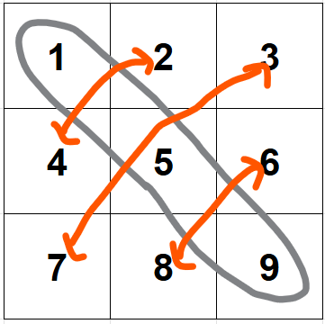
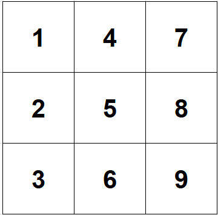
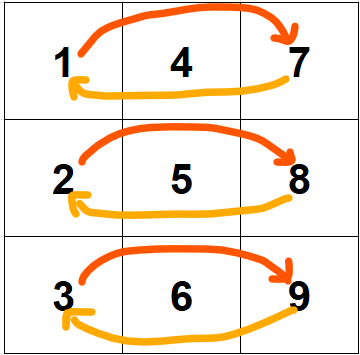
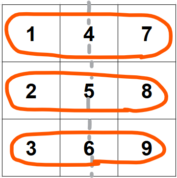
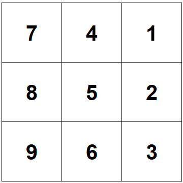

<p align="center">
  
  <h1 align="center" style="font-size: 35px"><a href="https://leetcode.com/problems/rotate-image/" target="_blank" rel="noreferrer">48. Rotate Image</a></h1>
</p>

<p align="center">
  
</p>

<p>You are given an <code>n x n</code> 2D <code>matrix</code> representing an image, rotate the image by <strong>90</strong> degrees (clockwise).</p>

<p>You have to rotate the image <a href="https://en.wikipedia.org/wiki/In-place_algorithm" target="_blank"><strong>in-place</strong></a>, which means you have to modify the input 2D matrix directly. <strong>DO NOT</strong> allocate another 2D matrix and do the rotation.</p>


<details>
<summary><em>Examples and Constraints</em></summary>
<br/>

Example 1


<pre><strong>Input:</strong> matrix = [[1,2,3],[4,5,6],[7,8,9]]
<strong>Output:</strong> [[7,4,1],[8,5,2],[9,6,3]]
</pre>

<br/>

Example 2


<pre><strong>Input:</strong> matrix = [[5,1,9,11],[2,4,8,10],[13,3,6,7],[15,14,12,16]]
<strong>Output:</strong> [[15,13,2,5],[14,3,4,1],[12,6,8,9],[16,7,10,11]]
</pre>

Constraints:
<ul>
	<li><code>n == matrix.length == matrix[i].length</code></li>
	<li><code>1 &lt;= n &lt;= 20</code></li>
	<li><code>-1000 &lt;= matrix[i][j] &lt;= 1000</code></li>
</ul>

</details>

<br/>

## **Solution**

| Time | Space |
|------|-------|
| `O(n²)` | `O(1)` |

- Transpose the matrix (swap the elements across the diagonal from top left to bottom right)
  
  
  
  - We'd end up with: 
  
    
- Now reverse these rows, or another way to look at it is to reflect each row horizontally:
  
   
- Finally we end up with:
  
  


<br/>

## **Code**

Python
```python
class Solution:
    def rotate(self, matrix: List[List[int]]) -> None:
        """
        Do not return anything, modify matrix in-place instead.
        """
        # transpose the matrix
        for i in range(len(matrix)):
            for j in range(i+1, len(matrix)):
                matrix[i][j], matrix[j][i] = matrix[j][i], matrix[i][j]
        
        # reverse the rows (horizontal reflection)
        for row in matrix:
            row.reverse()

        # OR do this for horizontal reflection:
        # n = len(matrix)

        # for i in range(n):
        #     for j in range(n // 2):
        #         matrix[i][j], matrix[i][n-j-1] = matrix[i][n-j-1], matrix[i][j] 
```
<br/>

C++
```cpp
class Solution {
public:
    void rotate(vector<vector<int>>& matrix) {
        // transpose the matrix
        for (int i=0; i < matrix.size(); i++) {
            for (int j=i+1; j < matrix.size(); j++) {
                swap(matrix[i][j], matrix[j][i]);
            }
        }

        // reverse each row (or in other words: do a
        // horizontal reflection)
        for (int i=0; i < matrix.size(); i++) {
            reverse(matrix[i].begin(), matrix[i].end());
        }
    }
};
```
<br/>


JavaScript
```javascript
var rotate = function(matrix) {
    // transpose
    for (var i=0; i < matrix.length; i++) {
        for (var j=i+1; j < matrix.length; j++) {
            [ matrix[i][j], matrix[j][i] ] = [ matrix[j][i], matrix[i][j] ];
        }
    }

    // reverse rows
    for (var row of matrix) {
        row.reverse();
    }
};
```
<br/>
